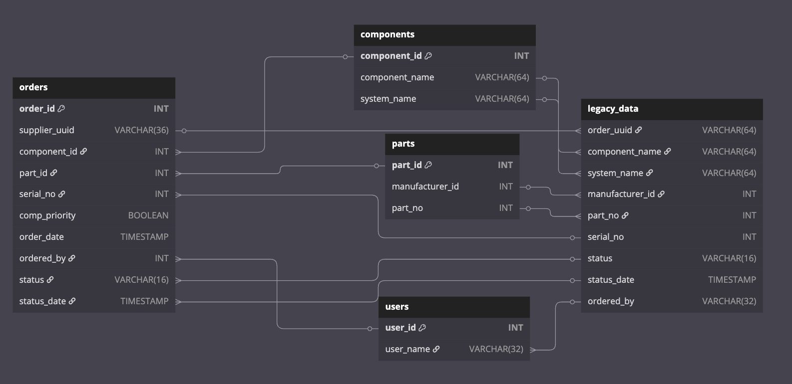

# Defense Unicorns - Data Engineering Practical

## Overview

This exercise is designed to assess a data engineering candidate’s ability to aggregate and clean data programmatically, interact with a database, and demonstrate their thought process in designing data systems. Candidates should complete the assessment within a four-hour time limit for code submission.  A python 3 framework using Docker to host a PostgreSQL 17.4 database is provided for development and testing.

Please note that this exercise is solely for evaluation purposes and will not be used in real-world applications by Defense Unicorns.

To complete the exercise please create a new repository from this template and push your changes to it. When complete email your recruiting contact at Defense Unicorns. The hiring team will then evaluate your submission, and if it meets the standard, move onto an in-person review of the submission where enhancements and other changes can be discussed.

## Quickstart
* Create a copy of this template repository by clicking "Use this template"
  followed by "Create a new repository" - you will work on your copy.
* Develop and test your solution
   * Use `make dev-up` to bring up postgres (or recycle postgres to blank tables)
* Run `make ingest` to test full ingestion in docker compose
   * WARNING: This will reset your postgres database
* Run `make submit` to create the pg_dump file and `src/` tarball and commit the
  created artifacts.


### Domain Overview

This exercise involves building a system to track parts orders for truck components. The company, which manufactures trucks, previously relied on a legacy ordering system that was lost due to poor disaster planning. The only remaining data is in the `/data` folder as extracts.

A DBA has designed a new PostgreSQL schema to store the recovered legacy data and track new orders. The system processes priority orders via a message queue and regular orders through nightly batch processing.

Your task is to write scripts to clean and ingest the legacy data, simulating both batch and stream processing. You should spend no more than four hours on the coding portion. Be prepared to discuss your approach during the assessment, but you do not need to submit written answers to the questions.

### Evaluation criteria
To "pass" the assessment, there must be valid *cleaned* entries in the `components` and `users` table for each element in the batch orders.  To be considered competitive, there should be an entry in the `parts` table for all parts in the batch and streaming data as well as an order in the `orders` table for each `order_uuid` in the both sources of data.  There will be other automated tests to check for cleaning and formatting as well.  There will also be a general assessment of code quality and complexity, but the highest weight is getting the right data into the database.

### Questions
Be prepared to answer questions about the design and implementation of the storage.  Examples include:
* Are there any important pieces of legacy information lost in the current schema?
* Assuming a year of orders are kept in the database before being moved to cold storage, how many orders per year would you feel comfortable supporting with this architecture?
* If you needed to build a REST API to serve data about Orders, what main endpoint would you use and how would you design it (query params, http method(s) etc)?
* If you could design the storage from scratch, what would you change?

## Data diagram



## Data descriptions - Postgres schema

The following are the descriptions of the fields in the new Postgres schema.  Keep in mind the legacy data may or may not meet these descriptions / types, or could have nonstandard formatting (names may appear in multiple places with different capitalization, for example).  The schema can be seen in `postgres/schema.sql`

### Component

A component is a part that can be used for business purposes (install in a truck).  Fields:
* `component_id`: database assigned integer primary key
* `component_name`: `VARCHAR(64)` name of component
* `system_name`: `VARCHAR(64)` name of system (valid names are `HYDRAULIC`, `ELECTRICAL`, `TRANSMISSION`, `NAVIGATION`)

### Part

A part is something that can be ordered, like a bolt or a chassis.  Parts are generalized to a manufacturer and part number, not specified to a serial number (physical instance of a part).  The fields are:
* `part_id`: database assigned integer primary key
* `manufacturer_id`: integer id for a manufacturer
* `part_no`: Manufacturer's part number for the specific part
The `manufacturer_id` and `part_no` tuples must be unique

### Users

This is a simple lookup table to hold user information.  Fields:
* `user_id`: database assigned integer primary key
* `user_name`: `VARCHAR(32)` format should be `first_name.last_name`

### Orders

This is the main table to track orders.  It has the following fields:
* `order_id`: database assigned integer primary key
* `supplier_uuid`: The supplier's `order_uuid` `VARCHAR(36)` UNIQUE NOT NULL
* `component_id`: References components table
* `part_id`: References parts table
* `serial_no`: Integer serial number of part ordered
* `comp_priority`: Boolean, false for batch orders, true for streaming orders
* `order_date`: Datetime the date status was set to `ORDERED` (may be null if last status is `PENDING`)
* `ordered_by`: References `users.user_id` that submitted the order
* `status`: `VARCHAR(16)`, current order status. valid entries are `PENDING`, `ORDERED`, `SHIPPED`, and `RECEIVED`
* `status_date`: Datetime the `status` field was set or updated
* an `order_id` has a unique mapping to a `supplier_uuid`.

## Data descriptions - Data dumps
The batch processing dump is in the `data/batch_orders.parquet` file and the streaming dump is in the `data/streaming_orders.json`.

### Batch Order Data
The batch orders are in a parquet where each row represents a status update.  Keep in mind that not every row has all of the fields filled so you'll have to do some aggregating and cleaning. Below is a list of fields and any cleaning needed.
* `order_uuid`: UUID the shipping system uses to keep track of orders
* `component_name`: name of the component (multiple cases, `'_'` may be interchanged with `' '` characters)
* `system_name`: name of the system (no cleaning required)
* `manufacturer_id`: integer id of the manufacturer (no cleaning required)
* `part_no`: integer part number (no cleaning required)
* `serial_no`: integer serial number (no cleaning required)
* `status`: status of order (no cleaning required)
* `status_date`: datetime of update in `YYYY-MM-DD HH:MM:SS` format
* `ordered_by`: Name of user who ordered part (only shows in `PENDING` rows for batch orders or `ORDERED` messages for the streaming format, different name formats)

### Priority (streaming) Order Data
The streaming data json has the following schema and has the same general cleaning requirements as the batch data
```json
{
   "order_uuid" : "string",
   "datetime" : "string, fmt: MM-DD-YYYY HH:MM:SS",
   "status": "string",
   "details":
   {
      "component_name": "string",
      "system_name": "string",
      "manufacturer_id": "int",
      "part_number": "int",
      "serial_number": "int",
      "ordered_by": "string"
   }
}
```
The `details` field is optional and is only included on `ORDERED` status messages.  The data was recovered in chronological order by `datetime`.

### Cleaning required
* Transform the component names into `lowercase_with_underscore_spaces` format.
* Transform the user names into `first_name.last_name` format.  Other formats you may encounter are `First Last` or `Last, First`.
* The `ordered_by` field in `data/batch_orders.parquet` may have some corrupt entries, be sure to pull from the correct rows

## Development and Evaluation
Most of the setup can be done via Make targets.  Here is a list of the relevant targets:
* `make help` - shows major targets
* `make help-dev` - shows helper targets
* `make dev-up` - stands up a new postgres instance (or recycles your current postgres) with the correct table schema in `postgres/schema.sql`
* `make ingest` - builds the solution image from the `/src` folder and runs it using docker-compose. WARNING: This will recycle the database
* `make submit` - creates the tarballs for submission in the `/submission` directory

Your ingestion script's entrypoint is in the method `ingest_data()` in `src/ingest.py`.

During development, feel free to push commits to your branch.  The automated tests will not be run until after the time has expired.

### Development Environment
Requirements:
* Internet connection (for pulling images from DockerHub)
* Docker
* Make
* Python 3.8+: If you need to use a lower version of python, make sure to test the image and potentially change the `/src/Dockerfile` and `requirements.txt` as the ingestion script will be run by that image.
* `tar` binary
* You may need some libraries installed for `fastparquet` to read the parquet file.  If you would prefer to use `pyarrow` or another method, that is fine, just be sure to change the `requirements.txt` and ensure the Dockerfile successfully builds the solution image

Use `make dev-up` to stand up the database or to stand up a fresh db with blank tables.  Here is a list of files for the solution:
* `src/ingest.py` entrypoint for ingestion, modify the `ingest_data()` method.
* `src/comms.py` contains `sqlalchemy` and `psycopg2` connection methods to the postgres database.
* `src/requirements.txt` keep track of dependencies here for the solution image to build.
* `src/logs.py` Configures a logging system for use with your ingestion solution

If you include additionally libraries or dependencies in your ingestion script, make sure you add them to `/src/requirements.txt` for the docker image to build and run successfully.

### Testing your solution

You may develop tests for your solution in the `/src/tests.py` file.  The default way these are implemented are using pytest, which will run any method that begins with `test`.  To run the tests, you can run `make run-tests` from the parent directory or `python -m pytest tests.py` from `src/`.

It is recommended for you to run an end-2-end test using docker compose.  This will tear down and rebuild the postgres database from scratch and run ingestion using the solution image.  You can run this test with `make ingest`, which will also save the logs from the ingestion container to `solution_logs.txt`.  This is not required but is highly recommended to ensure the automated tests run successfully.  There is a logging system included, so please make use of the logger to put relevant information into the `solution_logs.txt`

### Submission

The primary way we will evaluate your submission is to build and run the solution image against Postgres using `docker-compose`, similar to the `make ingest` target.  We will then run some automated tests against the data in postgres.

As a backup, please run `make submit` prior to making and pushing your submission commit which will build the following artifacts as tarballs (again this is a backup if there are problems with the container image)
* `submission/pg_dump.tar` - pg_dump of orders database
* `submission/src.tar.gz` - tarball of the `src` directory

Once you are satisfied with your solution and have created the pg_dump file, push your full solution to your repository.
